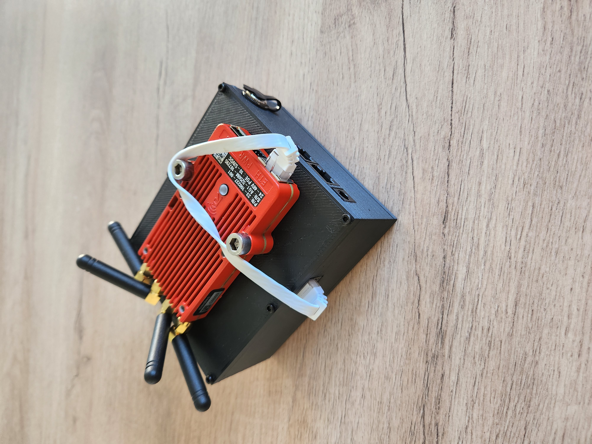
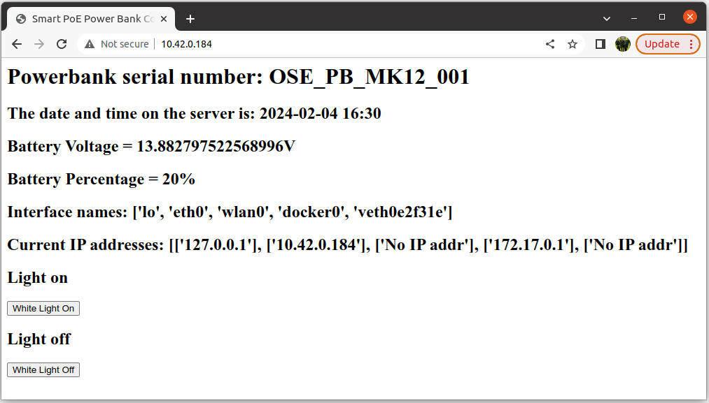
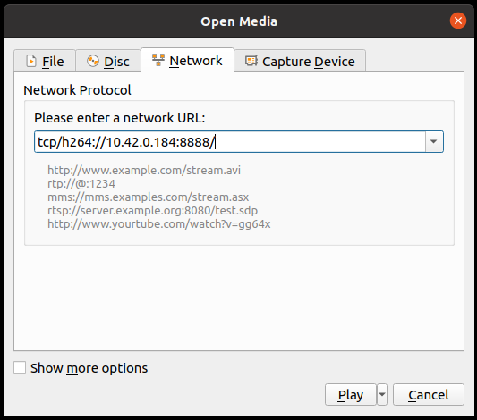
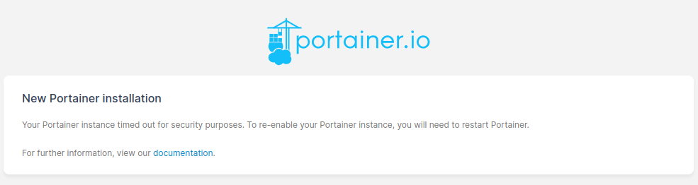

# Specifications

- 74 Wh battery capacity, giving ~14 hour battery life with Rajant Cardinal
- Onboard 120 degree FoV camera with autofocus and HDR, which can stream to DVR / VNC, can also record video and capture images at 12MP
- Built in lighting system
- Built in OLED display, showing battery and network information as well as serial number
- Built in webserver to allow remote MK12 Powerbanks to be interrogated 
- Small form factor - 120x103x51 mm
- USB2.0 for additional device connectivity 
- Docker and Portainer support for 3rd part applications
- 10/100 Ethernet switch, 3 ports accessible to user
- Designed for Rajant Cardinal

# CE and UKCA Certificates

https://chick92.github.io/powerbank_instructions_mk12/CE_MK12.pdf

https://chick92.github.io/powerbank_instructions_mk12/UKCA_MK12.pdf

# Risk Assessment

https://chick92.github.io/powerbank_instructions_mk12/Risk_Assessment_usage_mk12_powerbank.pdf

# Document Nomenclature

Any commands that must be entered in the termnal, which are written in this document will start with a $ symbol. 

$ ssh pbng@10.42.0.184

This command should be copied into a terminal window, without the $ symbol.

# Quick Start

##### Mounting Rajant Cardinal

The MK-12 Smart PoE Powerbank is designed to have a Rajant Cardinal mounted to it's top surface, using 2x M6x25 mm bolts. The included 15cm Ethernet cable should be used with the Cardinal. This cable is to be inserted into the RJ45 jack on the side of the powerbank, which is marked "Rajant", ran over the top of the unit and plugged into the Cardinal's RJ45 recepticle.

##### Connecting peripheral tablets / computers

The MK12 has a built in 10/100 Ethernet network switch, of which 3 ports are exposed to the user (a further 4th port is used for the MK12's computer, and a 5th port is unused but is available for bespoke use). Of the 3 ports that are exposed to the user, one is a passive PoE port that can be used to power a Rajant Cardinal (or indeed ES1 or DX2 etc), or other device which can be powered by passive PoE (14.8V nominal).

To add devices to the Rajant ethernet LAN, simply connect to the switch ports marked Eth0 and Eth1.

The MK12  can also be connected to existing WiFi networks as a new client. This is discussed in the section "Joining WiFi Access Points".

##### Accessing and using the device status webserver

The MK-12 has a built in webserver that can be used to interrogate the device for Network IP addresses, battery state and to control the built in lighting system.

To access it, use a browser on a device that is on the same LAN (Rajant, Ethernet or WiFi) and enter the device IP address into your browsers search bar. The Ethernet IP address of the MK-12 is displayed on the front mounted OLED screen.

e.g 192.168.50.201

##### Accessing the video stream from the camera

The MK-12 has a built in 12 MP camera with autofocus. An RTSP stream is available to the user for recording and viewing with DVR software. The format is H.264.

To access the stream using VLC on a linux system, the user can open a terminal window and execute the following command:

$ vlc tcp/h264://WWW.XXX.YYY.ZZZ:8888/

Where WWW.XXX.YYY.ZZZ is the ip address of the MK-12 

On other operating systems, the user can open VLC > Media > Open Network Stream 

Copy the following into the text field:

tcp/h264://WWW.XXX.YYY.ZZZ:8888/

Where WWW.XXX.YYY.ZZZ is the ip address of the MK-12 

##### Power on and power off

To power off the MK-12, press and hold the safe shutdown button on the side of the unit for 4 seconds. When a safe shutdown has been initiated, the display will stop updating and the lamp will light up for 3 seconds before switching off again. 

You can then press the power button on the other side of the device to disconnect power to the system.

##### Charging the device

To charge the MK-12, connect the provided charger to the charge input on the rear of the device.

DO NOT operate the device whilst it is charging. 

Once connected, the charging LED on the charger will flash green. When complete, it will be solid green. Should any faults be detected, the fault LED will light up red.

# SSH'ing Into Device

To SSH into the MK12 device, open a terminal and type the following:

$ ssh pbng@WWW.XXX.YYY.ZZZ

where WWW.XXX.YYY.ZZZ represents the IP address of the device on the chosen network adaptor. The ethernet IP address will be displayed on the OLED screen of the device. 

Password - ospreysystems

# Accessing Portainer

Portainer is used to manage all aspects of the MK-12 From Portainer, the user can make changes to the Ethernet IP address of the unit, join a WiFi access point, make software updates and install 3rd party software for sensor utilisation. 

To access portainer, use a browser on the same network as the MK12 Smart PoE Powerbank, using the following address:

https://localhost:9443 

Where localhost is the IP address of the device. This can be either Ethernet (via or without rajant). The Ethernet IP address will be displayed on the OLED screen of the device.

The username for portainer is - admin
The password for portainer is - ospreysystems

After a system update, on rare occasions Portainer may require a restart. This is indicated when attempting to access the webserver and the user being greeted with the following:

This can be fixed by SSH'ing into the MK12 device and running the following command:

$ sudo docker restart portainer

# Joining a WiFi Access Point

SSH into the MK12 device and enter the following:

$ sudo raspi-config

Using the arrow keys, navigate to: 1 - System Options, S1 - Wireless LAN

Enter the new SSID, navigate to the OK tab with the arrow keys and press enter, then enter the password and do the same again.

# Changing the IP address of the Ethernet port / Rajant subnet

SSH into the device and enter the following:

$ sudo nmcli con mod "Wired connection 1" ipv4.method manual ipv4.addr "192.168.XXX.YYY/24"

where XXX.YYY represent the specific ip address and subnet you wish the device to have, e.g 192.168.50.102

The speach marks are part of the syntax, enter the above as it is typed out!

The system must be rebooted for the changes to take effect - 

$ sudo reboot now

# Adding Additional Sensors / Software

The MK12 Smart PoE Powerbank is designed to be used as both a Rajant host system and an edge compute unit for additional peripherals. 

Docker is utilised for 3rd party peripherals, and docker images can be uploaded to the MK12 Smart PoE Powerbank, along with their respective docker-compose.yml files and any required .env files to form a suitable stack.

Navigate to:
- images - upload the tar file to the drive here
- navigate to stacks once it's uploaded
- add stack 
- give it an appropriate name
- copy and paste whatever is in your docker compose file into the editor, you can also upload it or grab it via git (not tested this)
- if you're using an .env file, you can upload it at the bottom too
- set the access controls (or lack of)
- deploy!

Importing an image

https://docs.portainer.io/user/docker/images/import

To save an image from the MK12 or your local dev environment (the MK12 utilises an ARM64 architecture):

$ sudo docker save --output ImageName.tar ImageName

This will save it as a tar file in your local directory, it won't have read / write permissions if you used sudo!

$ sudo chmod +777 ImageName.tar

# nmap

Nmap is a network scanning utility that is installed on the MK-12. It can be accessed through an SSH connection. Nmap allows the user map the network and identify connected servers such as robots and other powerbanks. 

To map the Ethernet network for example, enter the following:

$ nmap 192.168.X*

Where X is the subnet, e.g if the MK-12 has an Ethernet IP address of 192.168.1.201, you would enter $ nmap 192.168.1.*

