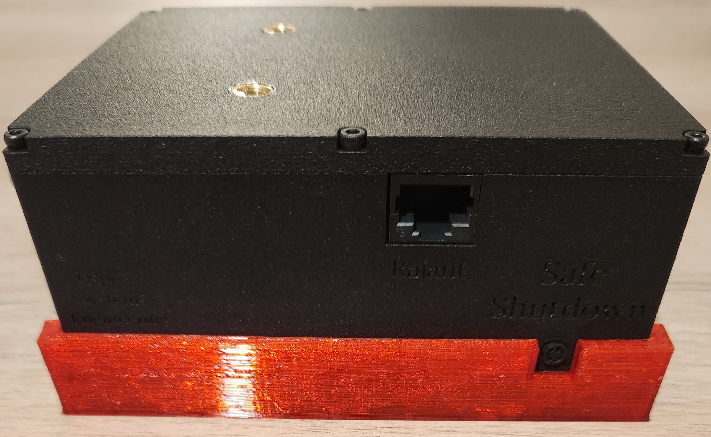

The OSE Smart PoE Powerbank is an edge compute unit designed to both power and compliment the Rajant intelligent mesh network. The Smart PoE Powerbank allows the user to deploy a Rajant mesh network in environments where AC wall power is not available (provides power and networking to the Rajant), and allows the user to integrate additional sensors onto the Rajant network through its USB or Ethernet interface.  

The Smart PoE Powerbanks run a local webserver (i.e a webserver is hosted on each powerbank) that can be accessed over the Rajant network. This enables the user to interrogate the battery status of each powerbank that is deployed in situ, without having to physically access them. Each Smart PoE Powerbank also has an OLED display which gives the user battery and networking information at a glance. 

The Smart PoE Powerbank is available with a Radeye DAQ (Data Acquisition) software license that enables it to log doserate and total absorbed dose from a connected Radeye G10 or G10X. The user can use the Rajant network to access this information remotely.  

The Smart PoE Powerbanks are designed to be deployed in situ by spot. If the user has a Boston Dynamics Spot robot with manipulator arm, the Smart PoE Powerbank / Rajant combination can be carried by the manipulator arm into the environment. This allows the user to set up adhoc Rajant networks without having to physically go into the environment. For dangerous environments such as nuclear, where there is a contamination or dose rate factor, this adds to the safety case and reduces the potential for operator dose rate uptake. 

The Smart PoE Powerbank is designed to operate both as Rajant power supply for Rajant nodes deployed in situ (and any other sensor accessories that the user wishes to use such as Radeye G10), and as part of a base station. The Smart PoE Powerbank features an ethernet switch that allows the user to connect computers and the spot table to, in order to access the Rajant / robot network.

The MK12 Smart PoE Powerbank also features an onboard 120 degree FOV camera which can be used with DVR systems on the Rajant network, or indeed computer applications, as well as a lamp that can be controlled by the webserver. These features enable the MK12 Smart PoE Powerbank to be used to provide a third person view of the environment for BVLOS (Beyond Visual Line of Site) robotic operations.  

Optionally, the Smart PoE Powerbank can be specified with an optional Radeye DAQ software license (includes Radeye data cable), allowing the Smart PoE Powerbank to function as a Rajant network connected data collection device. When a Thermo Fisher Radeye G10 is connected, the user can access the live dose rate and total accumulated dose of the connected radeye. This is useful for remote, adhoc situation monitoring and for tracking the absorbed dose of the Rajant / Powerbank combination.  This license is perpetual, there is no end date.

- [Specifications](#specifications)
- [CE Certificates](#ce-certificates)
- [MSDS](#msds)
- [Risk Assessment](#risk-assessment)
- [Export Tariff Code](#export-tariff-code)
- [Document Nomenclature](#document-nomenclature)
- [Quick Start](#quick-start)
        - [Mounting Rajant Cardinal](#mounting-rajant-cardinal)
        - [Connecting peripheral tablets / computers](#connecting-peripheral-tablets--computers)
        - [Accessing and using the device status webserver](#accessing-and-using-the-device-status-webserver)
        - [Accessing the video stream from the camera](#accessing-the-video-stream-from-the-camera)
        - [Power on and power off](#power-on-and-power-off)
        - [Charging the device](#charging-the-device)
          - [ISDT charger](#isdt-charger)
          - [RS charger](#rs-charger)
- [SSH'ing Into Device](#sshing-into-device)
- [Accessing Portainer](#accessing-portainer)
- [Joining a WiFi Access Point](#joining-a-wifi-access-point)
- [Changing the IP address of the Ethernet port / Rajant subnet](#changing-the-ip-address-of-the-ethernet-port--rajant-subnet)
- [Adding Additional Sensors / Software](#adding-additional-sensors--software)
- [nmap](#nmap)

# Specifications

- 74 Wh battery capacity, giving ~14 hour battery life with Rajant Cardinal
- Onboard 120 degree FoV camera with autofocus and HDR, which can stream to DVR / VNC, can also record video and capture images at 12MP
- Built in lighting system
- Built in OLED display, showing battery and network information as well as serial number
- Built in webserver to allow remote MK12 Powerbanks to be interrogated 
- Small form factor - 120x103x51 mm
- USB2.0 for additional device connectivity 
- Docker and Portainer support for 3rd part applications
- 10/100 Ethernet switch, 3 ports accessible to user
- Designed for Rajant Cardinal

# CE Certificates

https://chick92.github.io/powerbank_instructions_mk12/CE_MK12.pdf

# MSDS

https://chick92.github.io/powerbank_instructions_mk12/MSDS.pdf

# Risk Assessment

https://chick92.github.io/powerbank_instructions_mk12/Risk_Assessment_usage_mk12_powerbank.pdf

# Export Tariff Code

HS  85177900

# Document Nomenclature

Any commands that must be entered in the terminal, which are written in this document will start with a $ symbol. 

$ ssh pbng@10.42.0.184

This command should be copied into a terminal window, without the $ symbol.

# Quick Start

##### Mounting Rajant Cardinal

The MK-12 Smart PoE Powerbank is designed to have a Rajant Cardinal mounted to it's top surface, using the included 2x M6x25 mm bolts. The included 15cm Ethernet cable should be used with the Cardinal. This cable is to be inserted into the RJ45 jack on the side of the powerbank, which is marked "Rajant", ran over the top of the unit and plugged into the Cardinal's RJ45 recepticle.

##### Connecting peripheral tablets / computers

The MK12 has a built in 10/100 Ethernet network switch, of which 3 ports are exposed to the user (a further 4th port is used for the MK12's computer, and a 5th port is unused but is available for bespoke use). Of the 3 ports that are exposed to the user, one is a passive PoE port that can be used to power a Rajant Cardinal (or indeed ES1 or DX2 etc), or other device which can be powered by passive PoE (14.8V nominal).

To add devices to the Rajant ethernet LAN, simply connect to the switch ports marked Eth0 and Eth1.

The MK12  can also be connected to existing WiFi networks as a new client. This is discussed in the section "Joining WiFi Access Points".

##### Accessing and using the device status webserver

The MK-12 has a built in webserver that can be used to interrogate the device for Network IP addresses, battery state and to control the built in lighting system.

To access it, use a browser on a device that is on the same LAN (Rajant, Ethernet or WiFi) and enter the device IP address into your browsers search bar. The Ethernet IP address of the MK-12 is displayed on the front mounted OLED screen.

e.g 192.168.50.201

##### Accessing the video stream from the camera

The MK-12 has a built in 12 MP camera with autofocus. An RTSP stream is available to the user for recording and viewing with DVR software. The format is H.264.

To access the stream using VLC on a linux system, the user can open a terminal window and execute the following command:

$ vlc tcp/h264://WWW.XXX.YYY.ZZZ:8888/

Where WWW.XXX.YYY.ZZZ is the ip address of the MK-12 

On other operating systems, the user can open VLC > Media > Open Network Stream 

Copy the following into the text field:

tcp/h264://WWW.XXX.YYY.ZZZ:8888/

Where WWW.XXX.YYY.ZZZ is the ip address of the MK-12 

##### Power on and power off

To power off the MK-12, press and hold the safe shut down button for 1-2 seconds, 3 times, with a 1-2 second pause between. After a 5-10 seconds the display will stop updating and the lamp will light up.

You can then press the power button on the other side of the device to disconnect power to the system.

##### Charging the device

Depending on the equipment purchased, the Powerbank will come with one of two chargers - an RS charger, or if you have purchased both a UGV and smart PoE Powerbanks, an ISDT charger. 

###### ISDT charger

Do not attempt to charge the MK12 Smart PoE Powerbank whilst it is powered on.

The charging input is NOT isolated from the battery, do not attempt to connect third party devices to this port as they will draw power even when the device is turned off. 

Charge time depends on initial state of charge (SoC), however 10\% initial SoC to 80\% SoC will take approximately 1.5 hours. 

It is recommended to store the smart PoE Powerbank for extended periods of time with a battery charge state of around 50\%. It is also recommended to not operate the Smart PoE Powerbank below a 20\% battery state of charge, in order to prolong battery lifespan.

The charger is an ISDT 608PD, chosen for its small form factor and USB C power input. Depending on your region, the included power supply will be either a UGREEN Nexode Pro or Anker Series 7 USB C brick. It is recommended that the user reads the included instructions of both these devices separately before use.

If using the UGREEN Nexode Pro, first connect the correct AC adapter to it, as shown below:

Plug the USB C brick into the AC outlet and connect the ISDT charger to it using the included USB C cable. The Power input on the ISDT charger is located at the top of the unit. If using the UGREEN Nexode Pro, connect the USB C cable to the port on the right hand side - USB C1 as shown below. There is only a single USB C port on the Anker Series 7.

Next connect the XT60 connector of the DC charging cable to the XT60 port on the bottom of the ISDT charger, and connect the DC barrel jack to the port on the rear of the Smart PoE Powerbank, as shown below, when connected the ISDT charger will display the input voltage and power from the USB C Power supply brick (20V, 65W for the Nexode Pro and 20V 65W for the Series 7) and the battery voltage of the connected device's battery (between 12V and 16.8V):

The ISDT charger will arrive pre configured for use with the Powerbanks and UGV. To start charging, long press the center button until the display changes to the charging menu:

Then short press the center button to begin charging. The charger will ask you if you wish to perform an unbalanced charge. press the right button to confirm, as the UGV battery and Powerbank battery handles balancing via the built in BMS (Battery Management System). 

The charger will now charge the Powerbank or UGV. The USB C power supply brick can get hot under load, do not touch it. Do not charge the UGV or powerbank unattended!

If you wish to adjust the charging current used, you can set this before charging by long pressing the centre button within the charging menu. The parameter that flashes will be altered with the left and right buttons. Short press the centre button to cycle through them.

DO NOT change LiPo, 4S or 4.20V. This is the cell chemistry - LiPo, cell configuration - 4S and cell mav voltage - 4.20V. The charge current can be adjusted from 1A to 3A. It is best to leave it on 3A for speed of charging. If you are using a single ISDT charger for both powerbanks and the UGV, set this to 2A.
###### RS charger

To charge the MK-12, connect the provided charger to the charge input on the rear of the device.

The provided charger is suitable for world wide application, and has different connectors to suit the AC outlet in your region.

DO NOT operate the device whilst it is charging. 

Once connected, the charging LED on the charger will flash green. When complete, it will be solid green. Should any faults be detected, the fault LED will light up red.

To change the AC outlet connector, depress the catch with a tool such as a screw driver and slide the connector off, and replace with the one suitable for your region.

# SSH'ing Into Device

To SSH into the MK12 device, open a terminal and type the following:

$ ssh pbng@WWW.XXX.YYY.ZZZ

where WWW.XXX.YYY.ZZZ represents the IP address of the device on the chosen network adaptor. The ethernet IP address will be displayed on the OLED screen of the device. 

Password - ospreysystems

# Accessing Portainer

Portainer is used to manage all aspects of the MK-12 From Portainer, the user can make changes to the Ethernet IP address of the unit, join a WiFi access point, make software updates and install 3rd party software for sensor utilisation. 

To access portainer, use a browser on the same network as the MK12 Smart PoE Powerbank, using the following address:

https://localhost:9443 

Where localhost is the IP address of the device. This can be either Ethernet (via or without rajant). The Ethernet IP address will be displayed on the OLED screen of the device.

The username for portainer is - admin
The password for portainer is - ospreysystems

After a system update, on rare occasions Portainer may require a restart. This is indicated when attempting to access the webserver and the user being greeted with the following:

This can be fixed by SSH'ing into the MK12 device and running the following command:

$ sudo docker restart portainer

# Joining a WiFi Access Point

SSH into the MK12 device and enter the following:

$ sudo raspi-config

Using the arrow keys, navigate to: 1 - System Options, S1 - Wireless LAN

Enter the new SSID, navigate to the OK tab with the arrow keys and press enter, then enter the password and do the same again.

# Changing the IP address of the Ethernet port / Rajant subnet

SSH into the device and enter the following:

$ sudo nmcli con mod "Wired connection 1" ipv4.method manual ipv4.addr "192.168.XXX.YYY/24" ipv4.gateway "192.168.1.254" ipv4.dns “8.8.8.8”

where XXX.YYY represent the specific ip address and subnet you wish the device to have, e.g 192.168.50.102

The DNS used is Google's DNS, and the gateway IP address will be that of your network router. Typically this is 192.168.XXX.1 or 192.168.XXX.254.

The speach marks are part of the syntax, enter the above as it is typed out!

The system must either be rebooted for the changes to take effect - 

$ sudo reboot now

Or, you can restart just the networking - 

$ nmcli con up "Wired connection 1"

# Adding Additional Sensors / Software

The MK12 Smart PoE Powerbank is designed to be used as both a Rajant host system and an edge compute unit for additional peripherals. 

Docker is utilised for 3rd party peripherals, and docker images can be uploaded to the MK12 Smart PoE Powerbank, along with their respective docker-compose.yml files and any required .env files to form a suitable stack.

Navigate to:
- images - upload the tar file to the drive here
- navigate to stacks once it's uploaded
- add stack 
- give it an appropriate name
- copy and paste whatever is in your docker compose file into the editor, you can also upload it or grab it via git (not tested this)
- if you're using an .env file, you can upload it at the bottom too
- set the access controls (or lack of)
- deploy!

Importing an image

https://docs.portainer.io/user/docker/images/import

To save an image from the MK12 or your local dev environment (the MK12 utilises an ARM64 architecture):

$ sudo docker save --output ImageName.tar ImageName

This will save it as a tar file in your local directory, it won't have read / write permissions if you used sudo!

$ sudo chmod +777 ImageName.tar

# nmap

Nmap is a network scanning utility that is installed on the MK-12. It can be accessed through an SSH connection. Nmap allows the user map the network and identify connected servers such as robots and other powerbanks. 

To map the Ethernet network for example, enter the following:

$ nmap 192.168.X.*

Where X is the subnet, e.g if the MK-12 has an Ethernet IP address of 192.168.1.201, you would enter $ nmap 192.168.1.*

